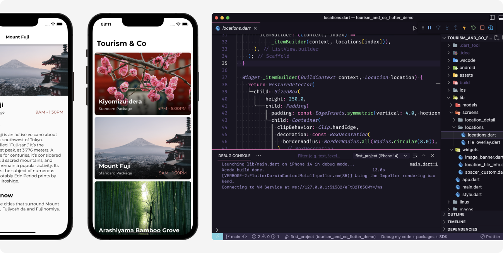

# Tourism & Co

## About

Mobile app to kick off my studies of Flutter and get to know basic widgets and other important constructs.

- Basic project setup
- Listing items
- Navigation
- Theming
- Styling

 

## Showcase and examples

 

## Extra notes

- As an exercise, this project wasn’t focused on advanced optimizations regarding data storage, processing, accessibility, scalability, cross-browser compatibilities, etc. There’s still a lot to be done about it.
- As most projects, this one is not bug/error-free. If you find any bug or unexpected behavior, feel free to get in touch, here is my email - dfaferreira46@gmail.com
